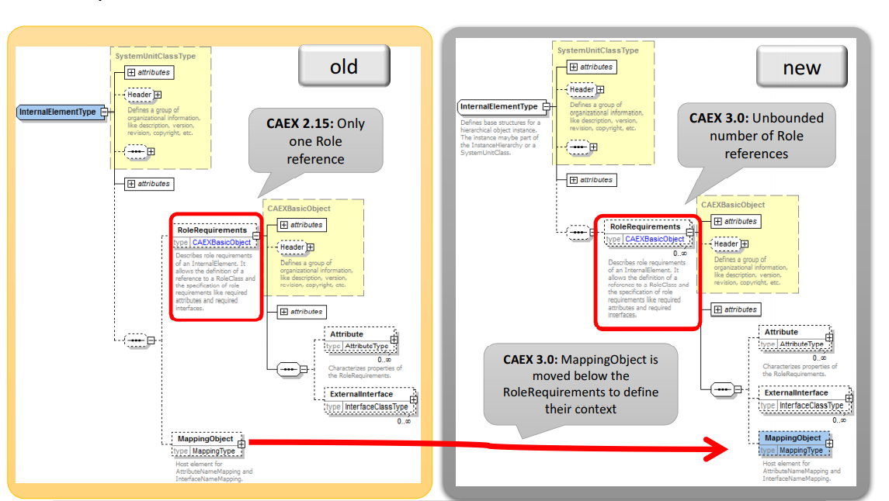
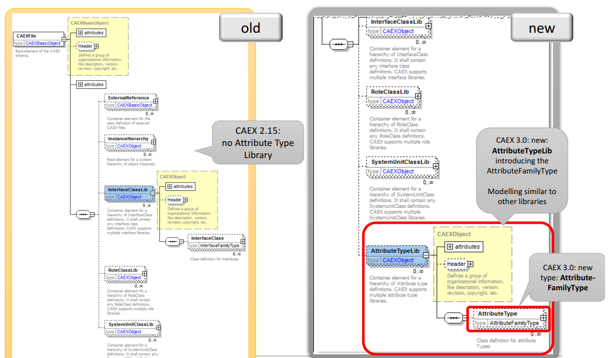
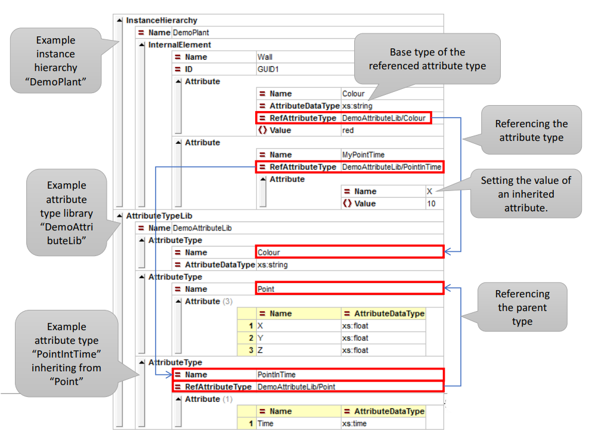
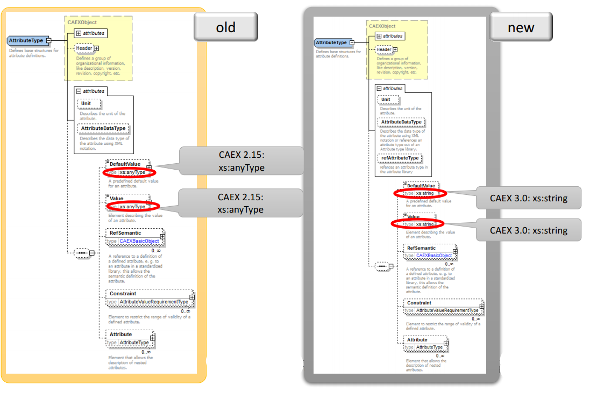
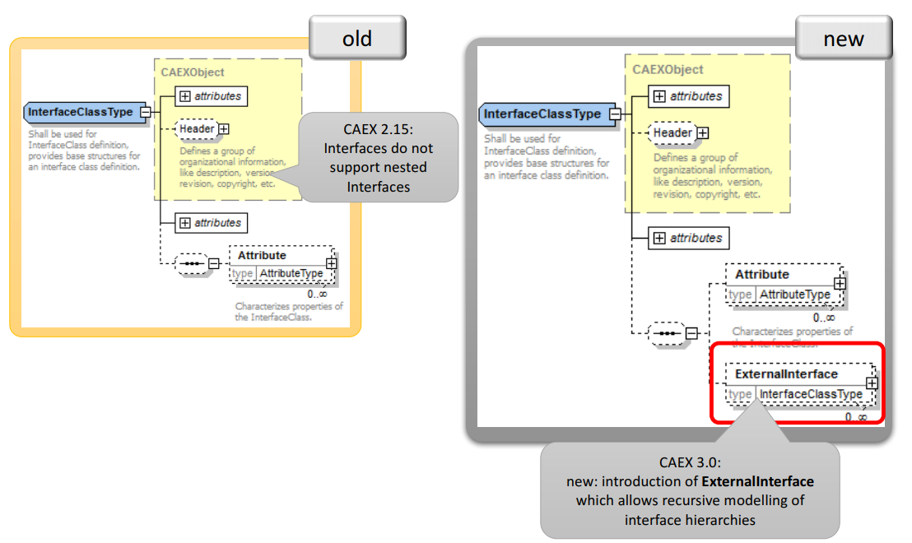
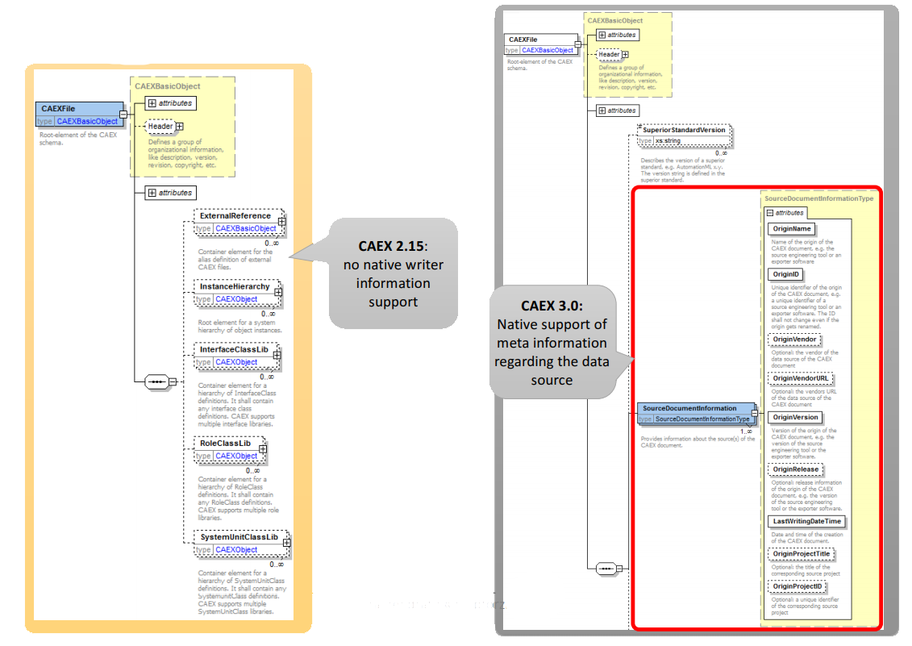
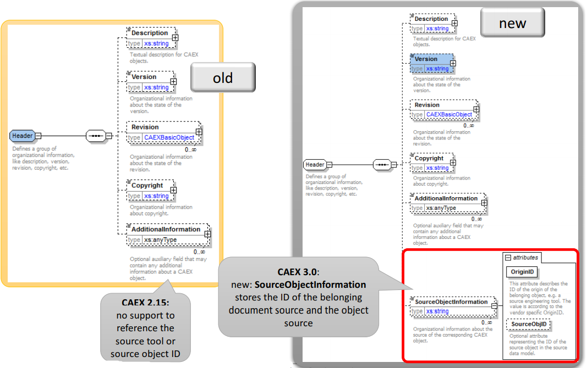
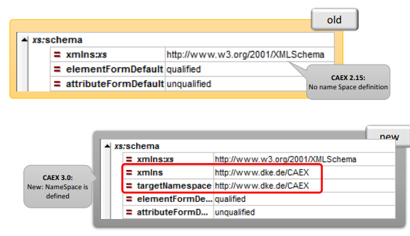
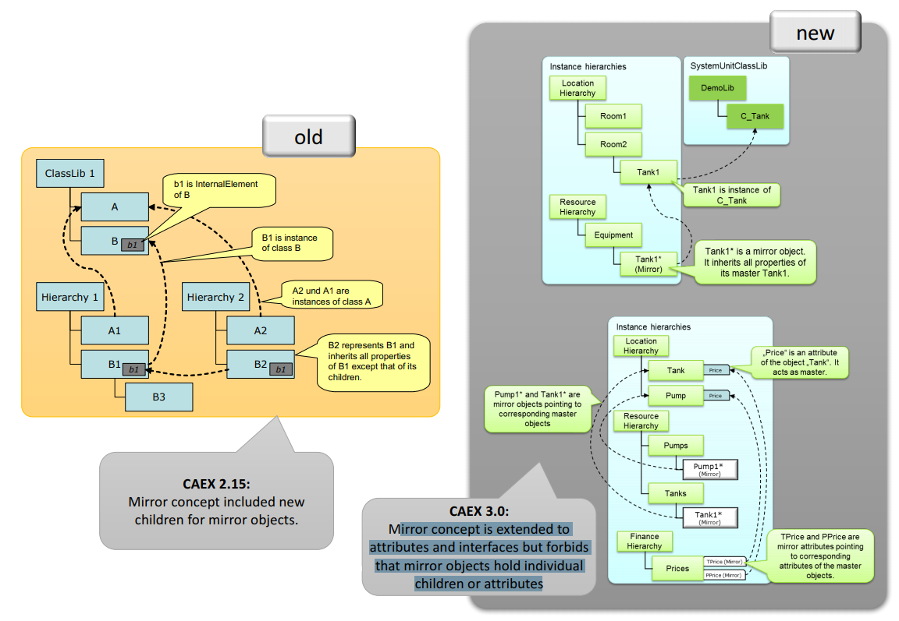
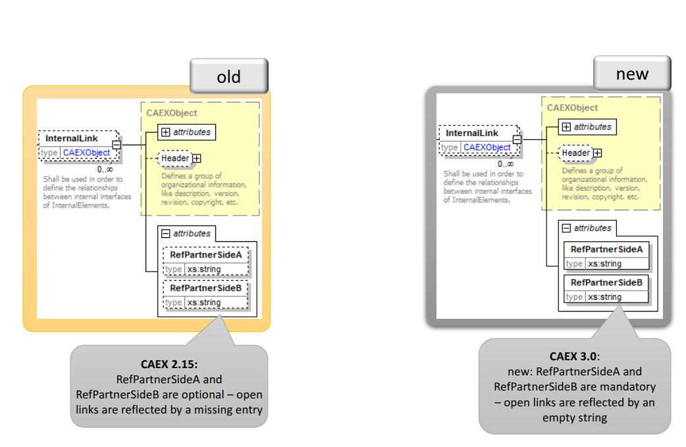

# CAEX Changes

Differences between CAEX 2.15 and CAEX 3.0.   
Edited by Prof. Dr.-Ing. Rainer Drath, Hochschule Pforzheim

This topic contains the following sections:

<ul>
<li><a href="#mandatory-attribute-refbaseroleclasspath">Mandatory Attribute RefBaseRoleClassPath</a></li>
<li><a href="#native-support-of-multiple-role-references">Native Support of multiple role references</a></li>
<li><a href="#attributelibrary-and-attributefamiliytype-with-reference">AttributeLibrary and AttributeFamiliyType with reference</a></li>
<li><a href="#xs-anytype-removed-and-replaced">xs:anyType removed and replaced</a></li>
<li><a href="#native-support-of-nested-interfaces">Native support of nested interfaces</a></li>
<li><a href="#superiorstandardversion">SuperiorStandardVersion</a></li>
<li><a href="#sourcedocumentinformation">SourceDocumentInformation</a></li>
<li><a href="#sourceobjectinformation">SourceObjectInformation</a></li>
<li><a href="#namespace-definition">Namespace definition</a></li>
<li><a href="#mirror-objects">Mirror objects</a></li>
<li><a href="#internallink">InternalLink</a></li>
<li><a href="#interface-mappings">Interface Mappings</a></li>
</ul>

AmlEngine2.1 supports AutomationML documents based on CAEX 2.15 as well as documents, based on CAEX 3.0.
The main differences between these versions are listed below. 
A document transformation service can be used, to transform CAEX 2.15 documents to CAEX 3.0 documents and back. 
An example implementation is provided [here](../Samples/service.md).

## Mandatory Attribute RefBaseRoleClassPath

The Attribute _RefBaseRoleClassPath_ defined for _RoleRequirements_ is mandatory in CAEX 3.0
\

\
[Back To Top](#CAEX-Changes)

## Native Support of multiple role references

In CAEX 3.0, the CAEX Element _InternalElementType_ can have multiple _RoleRequirements_ assigned.

The _MappingObject_ is moved below the _RoleRequirements_ to define their context.
\
 
\
[Back To Top](#CAEX-Changes)

## AttributeLibrary and AttributeFamiliyType with reference

The _AttributeTypeLib_ is a new library type in CAEX 3.0. It contains _AttributeFamilyTypes_ which can be referenced in Attributes with the _RefAttributeType_ to define the Attribute Type.
\

\

**Attribute Library Example**
\

\
[Back To Top](#CAEX-Changes)

## xs-anyType removed and replaced

The _xs:anyType_ has been replaced with _xs:string_ as value type.
\

\
[Back To Top](#CAEX-Changes)

## Native support of nested interfaces

The _InterfaceClassType_ can contain child _ExternalInterfaceType_ elements.
\

\
[Back To Top](#CAEX-Changes)

## SuperiorStandardVersion

The new attribute _SuperiorStandardVersion_ allows defining the superior version number of the used AutomationML standard.
\

\
[Back To Top](#CAEX-Changes)

## SourceDocumentInformation

In CAEX 3.0, the _SourceDocumentInformation_ shall be used to define information about the data source.
\

\
[Back To Top](#CAEX-Changes)

## SourceObjectInformation

The new element _SourceObjectInformation_ can be used to store the original object-ID of the belonging document source and object source.
\

\
[Back To Top](#CAEX-Changes)

## Namespace definition

In CAEX 3.0 a namespace definition for the CAEX schema is added.
\

\
[Back To Top](#CAEX-Changes)

## Mirror objects

In CAEX 3.0 the Mirror concept is extended to attributes and interfaces but forbids that mirror objects hold individual children or attributes.

\

\
[Back To Top](#CAEX-Changes)

## InternalLink

The modeling of _InternalLinks_ has been refined. The _RefPartnerSideA_ and _RefPartnerSideB_ are mandatory, open links are reflected by an empty string.

\

\
[Back To Top](#CAEX-Changes)

## Interface Mappings

The _InterfaceNameMapping_ has been replaced by the _InterfaceIdMapping_. Interface mapping bases on the CAEXObject IDs instead of the CAEXObject names.

\

\
[Back To Top](#CAEX-Changes)
